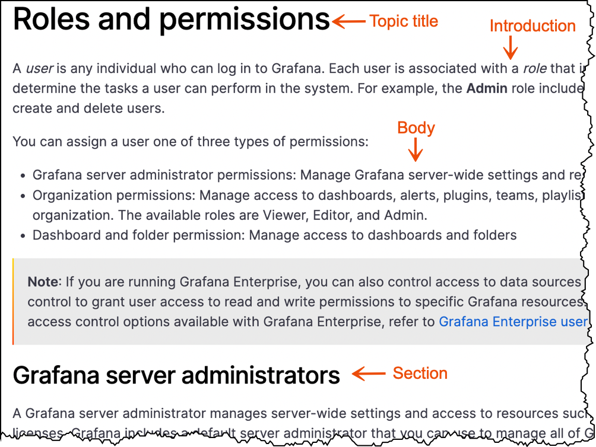

# Concept topic

A concept provides an overview and background information to help end users understand a product, interface, or task. Concepts answer the question “what is it?”. Readers learn about features through concepts.

The following types of content can be included in concepts:

- Detailed overviews of Grafana's features with benefits and clearly defined terms
- Diagrams that help users understand the components of a system
- Process flow diagrams
- Best practice guidelines
- An example of how a feature is used. Examples might include screenshots or other supporting visuals

A concept topic does not include:

- Step-by-step instructions
- Reference information, such as lookup tables or lists of values

## Concept topic structure

A _concept_ topic includes the following elements:

- **Topic title:** Topic titles should be nouns, for example, Grafana panels. By using this naming convention, readers are able to distinguish between conceptual topics and tasks that begin with verbs.
- **Introduction:** Include an introduction that explains what this topic is about.
- **Body:** Provide as much content as needed to explain the concept thoroughly. There can be sections, visuals, and text in the body of a concept.

<figure>

</figure>

## Write a concept topic

To write a concept topic, follow these steps.

1. Decide which top-level entity you want to add documentation to by reviewing Grafana Labs' product documentation.
1. Within the top-level entity, create a parent directory with the following naming convention:

   - Use a noun
   - Use lowercase letters
   - Add a hyphen between words
      
      
     For example: - organization-management - alert-groups - installation - service-accounts
      
      

1. Within the parent directory, create an `_index.md` file.
1. Add front matter to the `_index` file.

   For more information about front matter, refer to [Front matter]().

1. Add the content to a copy of the [Concept template](https://github.com/grafana/writers-toolkit/blob/main/docs/static/templates/concept-template.md).

   For more information about the kinds of content you can add to a concept topic, refer to [Concept topics](#concept-topic).

## Concept topic examples

Refer to the following topics for concept topic examples:

- [Roles and permissions](/docs/grafana/latest/administration/roles-and-permissions/)
- [Deployment modes](/docs/loki/next/fundamentals/architecture/deployment-modes/)
- [Best practices for managing dashboards](/docs/grafana/latest/best-practices/best-practices-for-managing-dashboards/)

## Concept template

When you are ready to write, make a copy of the [Concept template](https://github.com/grafana/writers-toolkit/blob/main/docs/static/templates/concept-template.md) and add your content.
