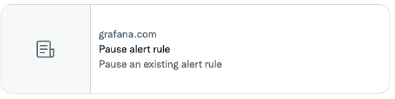

# Front matter

Grafana technical documentation includes front matter to help organize the content, develop the TOC (as published in the left-hand sidebar of the website), and help users identify useful pages when searching or viewing the content in search engines or in social media, such as Twitter.

Use YAML for all front matter.
In certain presentations, all front matter characters might render literally.
For this reason, _do not_ include any special Markdown formatting, like italics, in front matter.

Here’s a correctly built example:

```
---
aliases:
  - /docs/mimir/latest/old-architecture/
description: Learn more about Grafana Mimir’s microservices-based architecture.
labels:
  products:
    - oss
keywords:
  - Mimir
  - microservices
  - architecture
menuTitle: Architecture
title: About Grafana Mimir architecture
weight: 100
---

# About Grafana Mimir architecture
```

## Reference

The following headings describe what each element does and provides guidelines for its content.

### `aliases`

Use to create redirects from the previous URL to the new URL when a page changes or moves. As a best practice, when you rename or move files, you should create an alias with a reference to the previous URL path to create a redirect from the old URL to the new URL. For more information, refer to [Hugo aliases](#hugo-aliases). In some cases, for example when you have deleted content or split a file into multiple topics, it may not be possible to create an alias for the moved content.

### `date`

Describes the initial publish date of the page.
Hugo produces XML page outputs for use by RSS feeds where users can be notified of updates.
Customers use RSS feeds of release notes pages to be notified of new releases.
Therefore, the `date` front matter is recommended for release note pages.

The value of the `date` field should be a full ISO 8601 timestamp.
For example, `date: "2023-04-24T00:00:00Z"` is 12:00 AM, Apr 24 Coordinated Universal Time (UTC).

The `date` front matter also impacts menu ordering.
Pages with more recent dates are lower in the menu.

### `description` (required)

Use to provide the short description of the topic to search engines, including the search engine used in the Grafana documentation site. The description is also displayed on social media, such as Twitter, to provide a clue to users about the page contents.

The number of characters vary by media, so make the description concise.
Provide enough information to guide users to the content by describing what content the link leads to.
Often, this doesn’t need to be original text, you can often scan the first few paragraphs to pluck the appropriate terms or phrases into the description.
If it's too long, it is harmlessly truncated on social media.
Use double quotes (`"`) to surround the title. Do not use smart quotes.

### `draft`

When set to `true`, this option prevents Hugo from rendering the content.
Use the command line flag `--buildDrafts` to generate content marked as `draft: true`.

### `keywords`

The website uses keywords to generate links to related pages in the _Related content_ sections.
They do not appear in the resulting HTML source for the page and do not affect search engine optimization (SEO).

Ideally, use single terms as opposed to phrases.

### `labels`

Use the `labels` key to add one or more values that you want to appear before the topic title on the published page.
Only certain labels are supported.

For `labels.products`, the supported values and the resulting published labels are as follows:

- `cloud`: "Grafana Cloud"
- `enterprise`: "Enterprise"
- `oss`: "Open source"

Labels can be inherited through cascading front matter.
Each project has a set of default labels that are defined in the root `_index.md` file of the project.

For versioned projects, the `_index.md` file resides in the `website` repository.
For other projects, the `_index.md` file resides in the project’s repository.

If the default labels are incorrect for a page or directory of pages, update the labels.
Also, if you are adding a new page, consider whether the default labels are appropriate.
For each page, include a label in the `labels.products` sequence for every product that the page relates to.

For example, if a **single page** describes a feature available in Grafana Cloud and Grafana Enterprise, the source file front matter should include the following:

```yaml
labels:
  products:
    - cloud
    - enterprise
```

For a **directory of pages** that describe a feature only available in Grafana Cloud, the branch bundle `_index.md` file front matter should include the following:

```yaml
cascade:
  labels:
    products:
      - cloud
```

### `menuTitle`

Use to specify a different heading in the sidebar navigation than the `title` element, for example if you want to abbreviate the topic heading in the table of contents.

### `title` (required)

Hugo uses the `title` to generate the sidebar table of contents if there is no `menuTitle` specified in the front matter. If the `doc-validator` linter has been implemented on your repository, your topic heading must exactly match the title in the metadata.

The `title` becomes the document title element in the HTML. Often browsers display this in the tab for the page.

Optimize the title for search engines. Use double quotes (`"`) to surround the title. Do not use smart quotes.

### `weight`

By default, topics are displayed in alphabetical order by `title`.

Use `weight` to specify a different topic order within the left-hand sidebar on https://grafana.com. Smaller numbers place the topic earlier in the guide or section of the guide. Pages with the same weight are displayed in alphabetical order.

Use increments of `100` for content files. Doing so makes it easier for you to re-order existing topics when you add new topics. Weights are per directory.

## Example with different page and menu titles

```
---
title: About Grafana Mimir architecture
menuTitle: Architecture
---
```

## Description example

On Twitter:



For example:

- Add a panel using these steps.
- Understand the configuration options provided by…
- Learn more about hash rings and their usage

## Hugo aliases

Technical writers use [Hugo aliases](https://gohugo.io/content-management/urls/#aliases) to create redirects to the current page from other URLs.

If you specify `aliases` in the front matter, Hugo creates a directory that matches the alias entry that contains a single `.html` file.

### Example

The following example file `intended-url.md` contains the alias `/original-url` within its YAML front matter:

```markdown
---
aliases:
  - /original-url/
---
```

Assuming a `baseURL` of `grafana.com`, the auto-generated alias `.html` file found at `https://grafana.com/original-url/` contains something like the following:

```html
<!DOCTYPE html>
<html>
  <head>
    <script>
      const destination = "https://grafana.com/intended-url/";
      console.log(window.location.search);
      document.head.innerHTML = `<meta http-equiv="refresh" content="0; url=${destination}${window.location.search}"/>`;
    </script>
    <title>https://grafana.com/intended-url/</title>
    <link rel="canonical" href="https://grafana.com/intended-url/" />
    <meta name="robots" content="noindex" />
    <meta http-equiv="content-type" content="text/html; charset=utf-8" />
    <noscript>
      <meta http-equiv="refresh" content="0; url={{ safeURL .Permalink }}" />
    </noscript>
  </head>
</html>
```

The `http-equiv="refresh"` `meta` tag attribute, injected by JavaScript, performs an HTML redirect.
For more detail about HTML redirects, refer to [HTML redirections](https://developer.mozilla.org/en-US/docs/Web/HTTP/Redirections#html_redirections).

> **Note:** The redirect relies on first party JavaScript support which is common but not necessarily universal.

### Guidelines

The correct way to use aliases depends on whether the project is versioned or not.

#### Versioned projects

Do not include an `aliases` entry that refers to the initial published website directory.
The version in the URL path can cause undesirable redirects, such as a redirect from latest content to an old version.
Aliases should be relative and not absolute paths so that old versions do not steal redirects from "latest" content when it is moved around.

##### Examples

To redirect the page `/docs/grafana/latest/alerting/silences/` to `/docs/grafana/latest/alerting/manage-notifications/create-silence/`, you must add a relative alias in the source file for `/docs/grafana/latest/alerting/manage-notifications/create-silence/` containing the relative alias to `/docs/grafana/latest/alerting/silences/`.

- The relative alias `./` refers to the page`/docs/grafana/latest/alerting/manage-notifications/` because that is the directory containing the page `/docs/grafana/latest/alerting/manage-notifications/create-silence/`.
- The relative alias `../` refers to the page `/docs/grafana/latest/alerting/`.
- The relative alias `../silences/` refers to the page `/docs/grafana/latest/alerting/silences/`.

Therefore, with the alias `../silences/` in the source file for the page `/docs/grafana/latest/alerting/manage-notifications/create-silence/`, Hugo will create a redirect page at `/docs/grafana/latest/alerting/silences/`.

To redirect the page `/docs/grafana/latest/alerting/unified-alerting/` to `/docs/grafana/latest/alerting/` you must add a relative alias in the source file for `/docs/grafana/alerting/` containing the relative alias to `/docs/grafana/latest/alerting/unified-alerting/`.

- The relative alias `./` refers to the page `/docs/grafana/latest/` because that is the directory containing the page `/docs/grafana/latest/alerting/`.
- The relative alias `./alerting/` refers to the page `/docs/grafana/latest/alerting/` which is the page itself.
- The relative alias `./alerting/unified-alerting/` refers to the page `/docs/grafana/latest/alerting/unified-alerting/`.

Therefore, with the alias `./alerting/unified-alerting/` in the source file for the page `/docs/grafana/latest/alerting/`, Hugo will create a redirect page at `/docs/grafana/latest/alerting/unified-alerting/`.

#### Other projects

Include an `aliases` entry for the current URL path.
Adding an `aliases` entry makes it safer to move content around as the redirect from old to new page location is already in place.
Hugo doesn't create a redirect `.html` file when the directory is already populated with content.
When a page is moved, update the `aliases` with the new URL path.

### Test an alias

To test an alias results in the correct redirect, use your browser or a command-line tool for making HTTP requests.

#### Use the browser

1. Start the documentation webserver with `make docs`.
1. Browse to the URL of the page that should be redirected.
1. Confirm that you are redirected to the desired page.

   For example, if you want the page `https://grafana.com/docs/grafana/latest/panels/working-with-panels/` to redirect to `https://grafana.com/docs/grafana/latest/panels-visualizations/panel-editor-overview/`, browse to the following URL in the browser to confirm the redirect is working: http://localhost:3002/docs/grafana/latest/panels/working-with-panels/.

#### Use `cURL`

1. Start the documentation webserver with `make docs`.
1. In a separate terminal, make an HTTP GET request to the URL of the page that should be redirected.
   For example, to request the page `localhost:3002/docs/grafana/latest/panels/working-with-panels/`

   ```bash
   curl localhost:3002/docs/grafana/latest/panels/working-with-panels/
   ```

   The output is similar to the following:

   ```console
   <!doctype html><html><head><script>const destination="http://localhost:3002/docs/grafana/latest/panels-visualizations/panel-editor-overview/";console.log(window.location.search),document.head.innerHTML=`<meta http-equiv="refresh" content="0; url=${destination}${window.location.search}"/>`</script><title>http://localhost:3002/docs/grafana/latest/panels-visualizations/panel-editor-overview/</title><link rel=canonical href=http://localhost:3002/docs/grafana/latest/panels-visualizations/panel-editor-overview/><meta name=robots content="noindex"><meta charset=utf-8><noscript><meta http-equiv=refresh content="0; url=http://localhost:3002/docs/grafana/latest/panels-visualizations/panel-editor-overview/"></noscript></head></html>
   ```

1. Confirm that the value of the `destination` `const` in the `<script>` tag is the pretty URL for the page with the alias.
