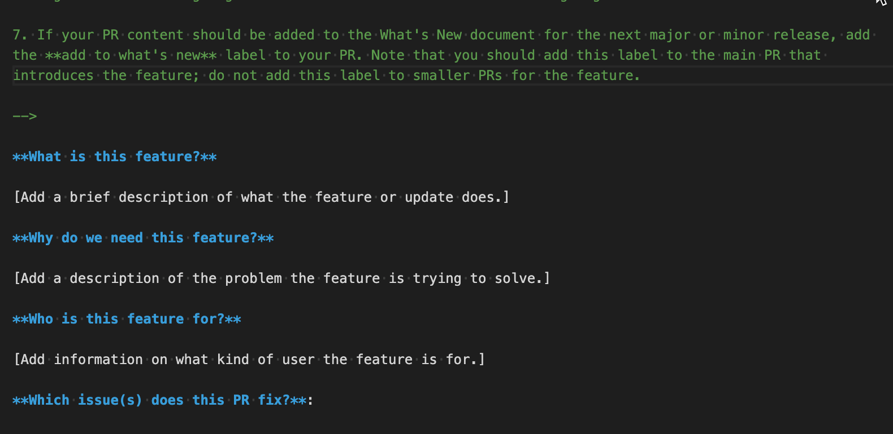
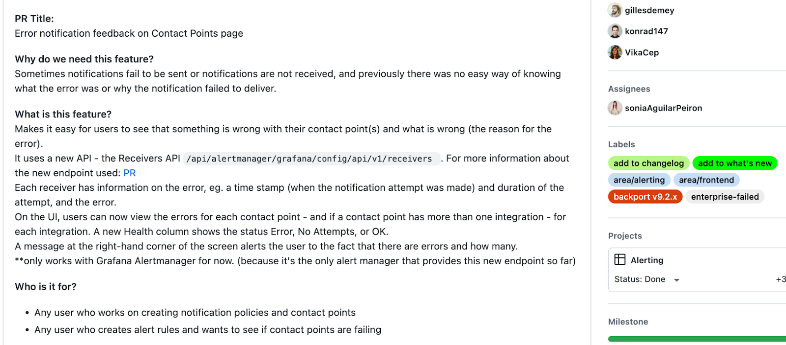

# Contribute to What's New or release notes

This topic explains the decisions and actions associated with collecting, writing, and publishing What's New content.

> **Note:** This topic is only relevant for internal Grafana Labs contributors.

## How to determine if content belongs in a What's New document

Grafana publishes a What’s New [docs page](//docs/grafana/latest/whatsnew/) and [blog post](https://grafana.com/blog/2022/11/29/grafana-9.3-release/) along with every minor and major release. These posts are popular, and a good way for users to learn about the exciting new things we’ve released. What’s New also drives our go-to-market enablement: we train the field and make videos on the topics in What’s New. However, unlike our comprehensive changelog, What’s New is curated. If it contained every update it would be too noisy for people to read, and if we wrote a detailed What’s New post for every little bug fix, we’d be wasting our time.

So how do you decide whether to write a What’s New post for your latest improvement?

### Add a What’s New for anything that could make a customer say “oo! 😃 ” or “ooo… 😬 ”

What's new content should address changes that have some kind of material impact on the user experience.

- Include changes that _affect customers_, whether they are new features to try out or important, long-requested bug fixes.
  - Most visualization changes and most additions to the UI should be in the What's new document, even when they seem small. 
- Almost every change or addition associated with Prometheus and Loki is of interest, too.
- What's New content should also include changes that require customers to do something, like change their API keys to Service Accounts, or stop using a deprecated API or plugin.
- A What's New doc should include announcements - things we want customers to notice and try out. These could also be notable community contributions where we want to thank a contributor.

When in doubt, ask your nearest PM or EM. Err on the side of _yes, put it in What’s New_.

### Examples of what to include in What’s New

- A new Transformation: [Partition by values](/docs/grafana/latest/whatsnew/whats-new-in-v9-3/#new-transformation-partition-by-values).
  - This is one of many transformations, but it is brand-new functionality that a user might not notice if they didn’t read the What's New document. What’s New is also a low-effort place to describe some nice use cases and examples for the feature so that users adopt it.
- The new [Candlestick visualization](/docs/grafana/latest/whatsnew/whats-new-in-v8-3/#candlestick-panel-beta).
  - This was a beta feature, but still listed in What’s new in order to get the word out and encourage users to try it.
- All-new Swagger docs for the API. 
  - This is significant because it makes our documentation much easier to use, and it’s a new place for users to go for help when using our API.
- [Removing beta labels from several panels](https://github.com/grafana/grafana/pull/58557), which makes then generally available. 
  - This is a small change code-wise, but a big statement with big customer impact. Customers now know that those plugins are fully supported and recommended for use in production.
- [New keyboard shortcut](https://github.com/grafana/grafana/pull/61837)
  - This is a small change, but it brings attention to a feature that has been improved recently and that most people don't know about.
- [Search improvement for Flame graphs](https://github.com/grafana/grafana/pull/61748)
  - Fuzzy search! Has to be in the blog post.
- [Changes to the Prometheus query editor](https://github.com/grafana/grafana/pull/60718)
  - These are query patterns for the data source that most of our users use.

### Examples of what *not* to include in What’s New

These are important improvements, but are better placed in the changelog than What’s new:

- [A docs update](https://github.com/grafana/grafana/pull/60352)
  - This update doesn’t require customers to change their behavior - they’ll simply see better instructions the next time they use the docs.
- [A bug fix related to migrations](https://github.com/grafana/grafana/pull/59438)
  - This is a bug fix that doesn’t require customer action.
- [A usability improvement to an existing transformation](https://github.com/grafana/grafana/pull/59074)
  - Nice fix, but very detailed. Should be in the changelog but not What’s New.
- [Change regex to accommodate a new branching strategy in Enterprise](https://github.com/grafana/grafana/pull/59429)
  - This change is invisible to customers.

## What's New doc development process

Developing directly in Markdown reduces errors and removes a manual (toilsome and error-prone step), by creating, editing, discussing, and publishing in the same format from which we will publish in GitHub, using the Grafana repo. 

We also recommend that you think critically about whether to include an image in the What’s New document. We will not maintain these images, as the document refelct a "point in time". If you need to add an image, refer to [Image, diagram, and screenshot guidelines]().

### When the prior release is complete

Complete the following steps after the prior release goes out.

1. The Docs Squad identifies the technical writer responsible for overseeing the What’s New content development process for the upcoming release.
1. The identified technical writer cuts a branch and creeates a PR with an empty What's New doc that will be populated with the What’s New content for the next release. 
1. The technical writer then pins a link to [version-number-release-gtm](https://raintank-corp.slack.com/archives/C02L8GQJGBW) Slack channel.

   > **Note:** A Product Manager (PM) is responsible for update the version number of that channel after a release goes out. 
   
1. The technical writer posts in the Slack channel that the What's New PR is ready for populating. 
1. The PM and Product Marketing Manager (PMM) organizations identify which PM or PMM is responsible for vetting content added to the What's New draft.
1. The PM or PMM on point communicates with eng squads without a PM resource about who’s on point for What’s New PR reviews from within the PM and PMM orgs.

### Throughout a release

A Grafana release cycle is typically 6-8 weeks, and during that time, developers are empowered to add to the What's New document incrementally. To see a list of release dates and assigned PMs and PMMs, refer to [Grafana Releases and Release Dates](https://grafana-intranet--simpplr.visualforce.com/apex/simpplr__app?u=/site/a145f000001dCXBAA2/page/a125f000001AXrwAAG).

During this time, the role of the technical writer is to periodically check in on the What's New PR to determine how much content has been added.

Complete the following steps throughout a release cycle:

1. Dev teams cut PRs against the branch and add What’s New content.
   - If a dev team has a PM, the dev team adds that PM or PMM as Reviewer.
   - If a dev team has a writer, the dev teams add the writer as Reviewer.
   - If a dev team does not have a PM or PMM, the dev team adds the identified PM or PMM as the reviewer.
1. Contributors label PRs with `add to what’s new` and write the PR description so it can be used as draft source for the What's New document. 

   > **Note:** This won't need to apply to every PR - just the primary PR that checks in the new feature, changed feature, or deprecation. 

   The following image shows an example What's New PR description field that include the information you should complete.

   <figure>
   
   </figure>

   The following image show a completed description for a What's New PR.

    <figure>
   
   </figure>

   The following example shows a completed PR with labels applied: https://github.com/grafana/grafana/pull/56225

1. PMs and/or PMMs review the content, offer suggestions, ask for clarifications, and generally collaborate.
1. During the PM/PMM-to-dev collaboration cycle, technical writers collaborate to provide development and copy edit.
1. After the review, the PM and/or PMM and technical writer approve the PR.
1. The technical writer merges the PR into the branch.

At this point, the larger Marketing org can review the What’s New content in the branch.

### At the end of a release

Complete the following steps in the days leading up to the release:

1. Five days before the GA release, the PM or PMM who is running the release sends out a **Last Call** to dev teams to get their What’s New content in.

1. Two days before the release, What’s New content is frozen.

1. On release day, the technical writer merges the What’s New branch into main and backports the doc to the feature version branch.

## Writing guidelines for What's New content

Follow these guidelines to ensure that your What's New or release notes content is clear, helpful, and easy to understand.

* Directly address your users.

    Address them using the imperative or as “you”.

    **Example:**
    Shorten your communication time when reporting issues and requesting help from Grafana Labs by grabbing a panel’s query response data and panel settings.

* Make use of active voice or present tense.

    **Example:**
    Enable a configuration option to skip user organization and roles synchronization with your SAML provider.

* Don't refer to the release version, for example, “In Grafana 9, we ” or “As of now, we”.

  The What’s New or release notes are understood to be providing information for a specific release, so there is no need to repeat this information.

* Provide high-level descriptions.

  Tell customers what goal they can accomplish or what problems they can solve with the feature. Describe the business value. Don't go into details about how the feature works, or configuration steps.

  Link out to topics in the documentation that provide more detailed information or steps.

  **Example:**
  Use custom branding to make Grafana your observability tool by adding your own sign-in page, help links, logo, application name, and more.

  For more information, refer to [insert link to documentation].

* Don't refer to how the feature used to work.

  For example, don't say "Previously, alert rules changed state when the rule was facing an error or a timeout. Now, the state does not update."

* For changes or updates to features, provide brief descriptions.
