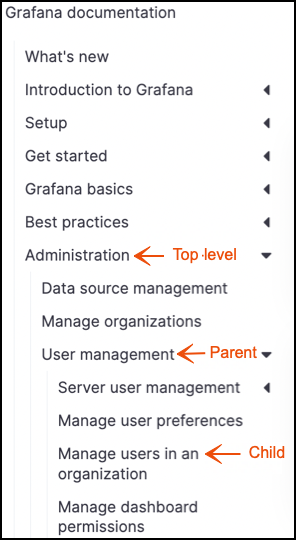
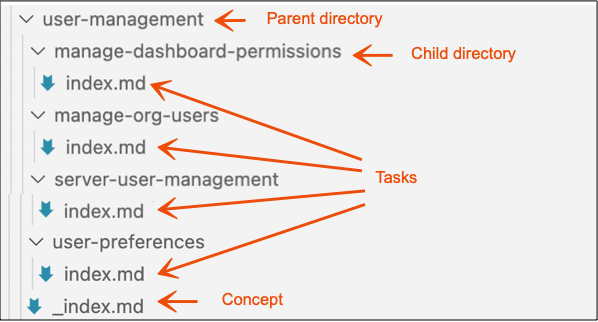

# Documentation structure

The technical writing team makes very intentional decisions about how we organize and structure product documentation. Users can find what they need quickly and easily with well-structured content.

Information architecture (IA) refers to the way in which content is organized. Before you start contributing to product documentation, it is important to understand the IA of the content.

Generally, the IA determines how content is:

- Titled
- Grouped
- Combined (or not combined) with other, related content

The following examples are based on the Grafana OSS and Enterprise documentation.

## Information architecture

The IA consists of the following levels.

**Top-level:** A table of contents top-level represents groups of features and functions of a product. The first step in contributing to the docs is to identify which top-level entity you will be contributing to.

> **Note:** You should not add a top-level entity to the table of contents. Reach out to the technical documentation team if it is not clear where your documentation belongs.

**Parent:** Each top-level entity has one or more parents, which are groups of related feature content. Parent topics assist users in navigating to child topics.

**Child:** This level of the information architecture includes includes concepts, tasks, or reference topics.

## Parent directory structure

Within the top-level directory, there is a parent directory.

The image below shows how the repository's `user-management` parent directory is structured.

- There is an `_index.md` file in the parent directory that serves as a landing page for the child topics. In most cases, `_index.md` contains conceptual content. For information about the types of conceptual content that you can add to the `_index.md` file, refer to [Concepts]().
- There are also four task topics in the parent directory, each with a directory and `index.md` file.

For more information about how to write concepts, refer to [Concepts]().
For more information about how to write tasks, refer to [Tasks]().

> **Note:** If a directory contains multiple pages or subdirectories, it is a branch bundle, and it must include an `_index.md` file. A directory containing only one page is a leaf bundle, and the content filename must be `index.md`.

## Useful links

- For more information about branch bundles and leaf bundles, refer to [Page bundles](https://gohugo.io/content-management/page-bundles/).
