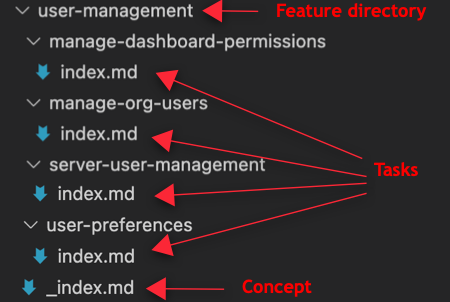

# Documentation structure

The help documentation for each product is logically organized which makes content findable - either by navigating the table of contents or searching via Google or the doc site search feature.

The way in which we organize content is referred to as the information architecture (IA). The IA for the help docs of each product does vary, so it is important that you understand the structure of the help docs before you start contributing.

In general, the IA determines how content is:
- Titled 
- Grouped
- Combined (or not combined) with other related content

The following examples are based on the Grafana OSS and Enterprise docs.

## Information architecture

The information architecture consists of the following levels.

**Topic area:** The topic area is the top-most level of the table of contents. The topic area represents major groupings of features and functionality. When you contribute to the docs, first identify which topic area you are contributing to.

> Note: Do not create new topic areas. If it is not obvious to you which topic area you should add your docs to, reach out to the Docs Squad.

**Feature:** Each topic area contains one or more features that Grafana customers use. In the image above, Grafana includes features that customers can use to manage their users. 

The feature level in the table of contents serves two purposes:

1. It provides a place for you to include supporting conceptual information.

1. It helps to organize related child topics. In this example, the user management feature docs include task topics on how to manage server users, user preferences, and organization users.

**Task:** This level of the information architecture includes step-by-step guidelines that users follow to complete a task or group of tasks.

## Feature directory structure
The feature directory exists within the topic area directory.

The following image shows the user management documentation as it is structured in the repository.

- The user-management feature directory contains an `_index.md` file that contains the contents of a concept.
- The user-management feature includes four task topics, each with its own directory and `index.md` file.

For more information about how to write concepts, refer to [Concepts](). For more information about how to write tasks, refer to [Tasks]().

> **Note:** If a directory contains multiple pages or subdirectories, then it’s a branch bundle and the index filename must be `_index.md`. If a directory contains only one page, then it’s a leaf bundle and the content filename must be `index.md`.
