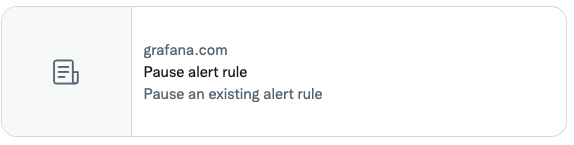

# Front matter

Grafana technical documentation includes front matter to help organize the content, develop the TOC (as published in the lefthand sidebar of the website), and help users identify useful pages when searching or viewing the content in search engines or in social media, such as Twitter.

Use YAML for all front matter.
In certain presentations, all front matter characters might render literally.
For this reason, _do not_ include any special Markdown formatting, like italics or monospace, in front matter.


Here’s a correctly built example:

```
    ---
    title: About Grafana Mimir architecture
    menuTitle: Architecture
    description: Learn more about Grafana Mimir’s microservices-based architecture.
    aliases:
      - /docs/mimir/latest/old-architecture/
    weight: 100
    keywords:
      - Mimir
      - microservices
      - architecture
    ---
# About Grafana Mimir architecture
```

The following list describes what each element does and provides guidelines for its content.

`title` **Required.**

:  Becomes the document title element. Often browsers display this in the tab for the page.

   It doesn't need to precisely match the `menuTitle`.
   Optimize the title for search engines. Use double quotes (`"`) to surround the title. Do not use smart quotes.

`description`

:  On social media, such as Twitter, displays as a clue to users about what the page includes.

   The number of characters vary by media, so make the description concise.
   Provide enough information to guide users to the content by describing what content the link leads to.
   Often, this doesn’t need to be original prose&mdash;you can often scan the first few paragraphs to pluck the appropriate terms or phrases into the description.
   If it's too long, it is harmlessly truncated on social media.
   Use double quotes (`"`) to surround the title. Do not use smart quotes.

`aliases`

:  Provides an HTML redirect from the pages in the list to the current page.
   Described in detail in Hugo aliases.

`weight`

:  Determines the placement of the topic within the left-hand sidebar on https://grafana.com. Smaller numbers place the topic higher in the guide. Pages with the same weight have lexicographic ordering.

   Use increments of `100` for all other content files. Doing so makes it easier for you to re-order existing topics when you add new topics. Weights are per directory.

`keywords`

:  The website uses keywords to link to related pages in the _Related content_ sections.
   They do not appear in the resulting HTML source for the page and do not affect SEO.

   Ideally, use single terms as opposed to phrases.

`draft: true`

:  When present, this option prevents Hugo from rendering the content.  Use the command line flag `--buildDrafts` to generate content marked as `draft: true`.

`# heading`

: If the `docs-validator` linter has been implemented on your repository, your topic heading must match the title in the metadata.

## Example with different page and menu titles

```
---
title: About Grafana Mimir architecture
menuTitle: Architecture
---
```

## Description example

On Twitter:



For example:

- Add a panel using these steps.
- Understand the configuration options provided by…
- Learn more about hash rings and their usage

## Hugo aliases

Technical writers use [Hugo aliases](https://gohugo.io/content-management/urls/#aliases) to create redirects to the current page from other URLs.

If you specify `aliases` in the frontmatter, Hugo creates a directory that matches the alias entry that contains a single `.html` file.

### Example

The following example file `intended-url.md` contains the alias `/original-url` within its YAML frontmatter:

```markdown
---
aliases:
  - /original-url/
---
```

Assuming a `baseURL` of `grafana.com`, the auto-generated alias `.html` file found at `https://grafana.com/original-url/` contains something like the following:

```html
<!DOCTYPE html>
<html>
  <head>
    <script>
      const destination = "https://grafana.com/intended-url/";
      console.log(window.location.search);
      document.head.innerHTML = `<meta http-equiv="refresh" content="0; url=${destination}${window.location.search}"/>`;
    </script>
    <title>https://grafana.com/intended-url/</title>
    <link rel="canonical" href="https://grafana.com/intended-url/" />
    <meta name="robots" content="noindex" />
    <meta http-equiv="content-type" content="text/html; charset=utf-8" />
    <noscript>
      <meta http-equiv="refresh" content="0; url={{ safeURL .Permalink }}" />
    </noscript>
  </head>
</html>
```

The `http-equiv="refresh"` `meta` tag attribute, injected by JavaScript, performs an HTML redirect.
For more detail about HTML redirects, refer to [HTML redirections](https://developer.mozilla.org/en-US/docs/Web/HTTP/Redirections#html_redirections).

> **Note:** The redirect relies on first party JavaScript support which is common but not necessarily universal.

### Guidelines

The correct way to use aliases depends on whether the project is versioned or not.

**Unversioned projects**
: Include an `aliases` entry that refers to the initial published website directory.
Adding an `aliases` entry makes it safer to move content around as the redirect from old to new page location is already in place.
Hugo doesn't create a redirect `.html` file when the directory is already populated with content.
: > **Note:** The published directory is dependent on which `content` subdirectory documentation is synced to in the website repository.
: > For example, documentation synced to a the `content/docs` directory requires the `/docs` prefix.

**Versioned projects**
: Do not include an `aliases` entry that refers to the initial published website directory. The version in the URL path can cause undesirable redirects, such as a redirect from latest content to an old version.
