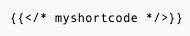

# Shortcodes

Shortcodes are predefined templates used for rendering snippets in Hugo.

## Why use shortcodes?

Markdown is limited in its ability to render complex elements. Although you might be tempted to insert HTML directly into content to make up for its limitations, you can instead use shortcodes to ensure consistency across the Grafana website.

The following sections describe shortcodes available for use in Grafana Markdown files. To learn about other shortcodes, refer to the Hugo [shortcode documentation](https://gohugo.io/content-management/shortcodes/).

> **Note for internal Grafana Labs contributors**: The Grafana shortcode templates are defined in the `layouts/shortcodes` folder of the website repo. To request custom shortcodes, [create an issue](https://github.com/grafana/writers-toolkit/issues).

## `admonition` shortcode

The `admonition` shortcode renders its content in a blockquote or stylized banner.
The style depends on the admonition type as defined in the Writers' Toolkit [Style conventions]({}).

The content of the admonition must be within opening and closing tags.

| Parameter | Description                                                     | Required |
|-----------|-----------------------------------------------------------------|----------|
| `type`    | The type of admonition. One of `note`, `caution`, or `warning`. | yes |


### Example

The following snippet renders an admonition of type `note` with a message `Kingston is the capital of Jamaica`.

```html
{}
Kingston is the capital of Jamaica.
{}
```


## `docs/shared` shortcode

The `docs/shared` shortcode lets you reuse content across the Grafana website by including shared pages from source content repositories. The source content repository must explicitly share the page by placing it into its `shared` directory.

To share content, follow these steps:

1. Create a Markdown file containing the source to be shared and include `headless: true` in the front matter to prevent the website from publishing the page.
1. Store the file in a shared folder.
1. To include the shared content in a Markdown file, insert the `docs/shared` shortcode with the following named parameters:

| Parameter     | Description                                                                                                                                                                                                                                         | Required |
| ------------- | --------------------------------------------------------------------------------------------------------------------------------------------------------------------------------------------------------------------------------------------------- | -------- |
| `lookup`      | Path to the included content relative to the root of the shared directory.                                                                                                                                                                          | yes      |
| `source`      | Name of the source content as shown on the website. For example, for the `grafana.com/docs/enterprise-metrics` content, the `source` is `enterprise-metrics`.                                                                                       | yes      |
| `version`     | Version of the source content to include. If not provided, the version is implicitly set to match the version of the destination content. If the including destination is at version `1.0.0`, then the version of included content is `1.0.0` also. | no       |
| `leveloffset` | Manipulates source content headings up to a maximum level of `h6`. Only positive offsets are currently supported. `leveloffset="+5"` ensures an `h1` in the source content is an `h6` in the destination content.                                   | no       |

> **Note:** Hugo doesn't rebuild the destination file when a source file changes on disk.
> To trigger a rebuild after changes to a source file, perform a trivial change to the destination file and save that, too.

### Examples

The following shortcode inserts the content from the `oauth2-block.md` file. The `lookup` path is relative to the `shared` folder in the `agent` source repo.

```markdown

```

The following shortcode inserts the latest version of `shared-page.md` from the `shared` folder in the `enterprise-metrics` content area. Headings are offset by one level, so if the source content contains an h1, the resulting heading is an h2.

```markdown

```

## `figure` shortcode

The `figure` shortcode renders an image with a caption using an HTML [`<figure>`](https://developer.mozilla.org/en-US/docs/Web/HTML/Element/figure#usage_notes) element. To add a figure, insert the `figure` shortcode with the following named parameters:

| Parameter        | Description                                                                                                                                                                                                                                                                | Required |
| ---------------- | -------------------------------------------------------------------------------------------------------------------------------------------------------------------------------------------------------------------------------------------------------------------------- | -------- |
| **animated-gif** | If set, the HTML contains a div with an image link instead of a `<figure>` element. It's typically used for animated screenshots. Shortcode parameters other than the `caption` and `maxWidth` parameters are ignored.                                                     | no       |
| **caption**      | Describes the figure using a [`<figcaption>`](https://developer.mozilla.org/en-US/docs/Web/HTML/Element/figcaption) element.                                                                                                                                               | no       |
| **class**        | Can be optionally used to override the HTML class for the `<figure>` element.                                                                                                                                                                                              | no       |
| **lazy**         | If set to `"false"`, the `lazyload` class is **not** also applied to the image. The `lazyload` class lets a browser render a page before the figure image loads. Once the image loads, the placeholder box transitions to the loaded image. Defaults to `"true"`.          | no       |
| **lightbox**     | If set to `"true"` the `figure-wrapper__lightbox` class is also applied to the `<figure>`.                                                                                                                                                                                 | no       |
| **link**         | If set the value overrides the `src` shortcode parameter as the value to the `href` in the `<a>` element in the `<figure>`.                                                                                                                                                | no       |
| **maxWidth**     | If set, `maxWidth` controls the maximum width of the `<figure>` using the [`max-width`](https://developer.mozilla.org/en-US/docs/Web/CSS/max-width) CSS property. When specifying a length or percentage, value should include unit of measurement (e.g. '75px' or '25%'). | no       |
| **showCaption**  | If set to `"true"`, the rendered `<figure>` includes a `<figcaption>` element with the caption set in `caption`. Defaults to `"true"`.                                                                                                                                     | no       |
| **src**          | Sets the source of the image.                                                                                                                                                                                                                                              | yes      |

### Example

```markdown

```

## `section` shortcode

The `section` shortcode renders an unordered list of links to a page's child pages. To add a section, insert the `section` shortcode with the following optional parameters:

| Parameter            | Description                                                                                                                                                                                                                                                             | Required |
| -------------------- | ----------------------------------------------------------------------------------------------------------------------------------------------------------------------------------------------------------------------------------------------------------------------- | -------- |
| **menuTitle**        | If set to `"true"`, the menuTitle parameter modifies the template to use the `menuTitle` parameter of a child page's front matter instead of the page title as the text in the link. If the child page doesn't have a `menuTitle` parameter, the title is used instead. | no       |
| **ordered**          | If set to `"true"`, the ordered parameter modifies the template to use an ordered list instead of an unordered list, displaying each item with a number marker                                                                                                          | no       |
| **withDescriptions** | If set to `"true"`, the withDescriptions parameter modifies the template to include the front matter descriptions for child pages that have them.                                                                                                                       | no       |

### Example

The following shortcode inserts a list of links to the pages's subpages. The links are named using the value of `menuTitle` from each subpage's front matter.

```markdown

```

## Escaping Hugo shortcodes

If you need to display the syntax for a shortcode, you can escape it using this syntax:



This markdown renders as:

```markdown

```
