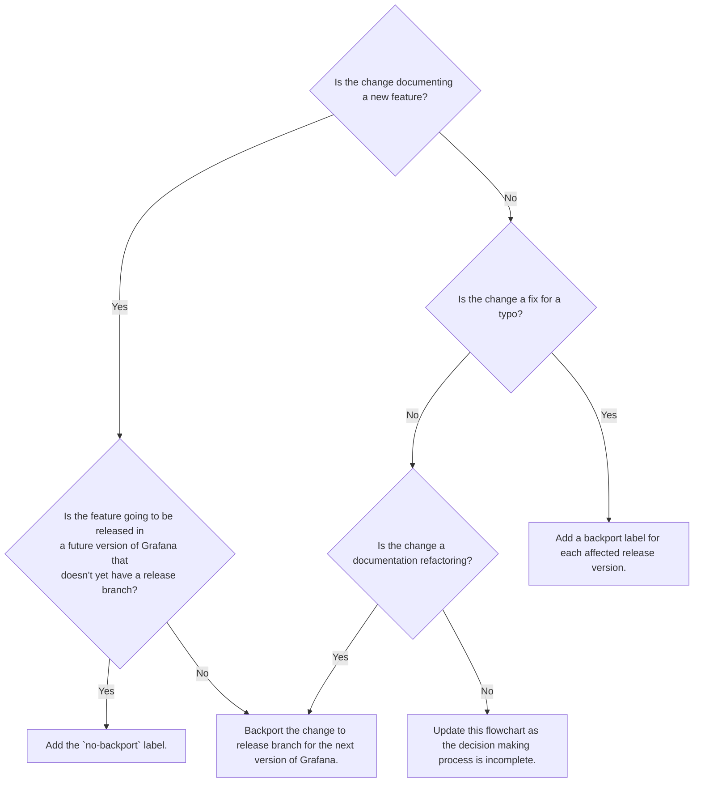

# Backporting

The `grafana/grafana` repository has multiple long-lived branches.
The `main` branch has the most recent code and documentation.
Releases use long-lived branches that include the major and minor versions of the release.
For example, the `v9.0.x` long-lived release branch contains code and documentation for all patched versions of the major version `9` and minor version `0` of Grafana.

Backporting takes a change from the `main` branch, and ports it back to an existing long-lived release branch.
During every pull request, each change to the `grafana/grafana` repository requires a decision about whether or not to backport it.

## Backport a change

To backport a change, use the appropriate `backport v<MAJOR>.<MINOR>.x` label.
You can backport to more than one branch by using multiple labels.

After the pull request is merged, the GitHub bot `grafanabot` creates a follow-up pull request for each of the `backport v<MAJOR>.<MINOR>.x` labels.
If `grafanabot` is unable to automatically backport the changes, it comments on the first pull request with instructions about how to backport the change manually.

In repositories such as `grafana/grafana` that sometimes creates a new branch for a release before the release has shipped.
If you intend to publish content against an imminent release, check for the existence of a backport label for the upcoming version when filing and also before merging.

If you decide to _not_ backport a change, use the `no-backport` GitHub label.

## When to backport

To decide whether to backport a pull request, use the following decision tree:

