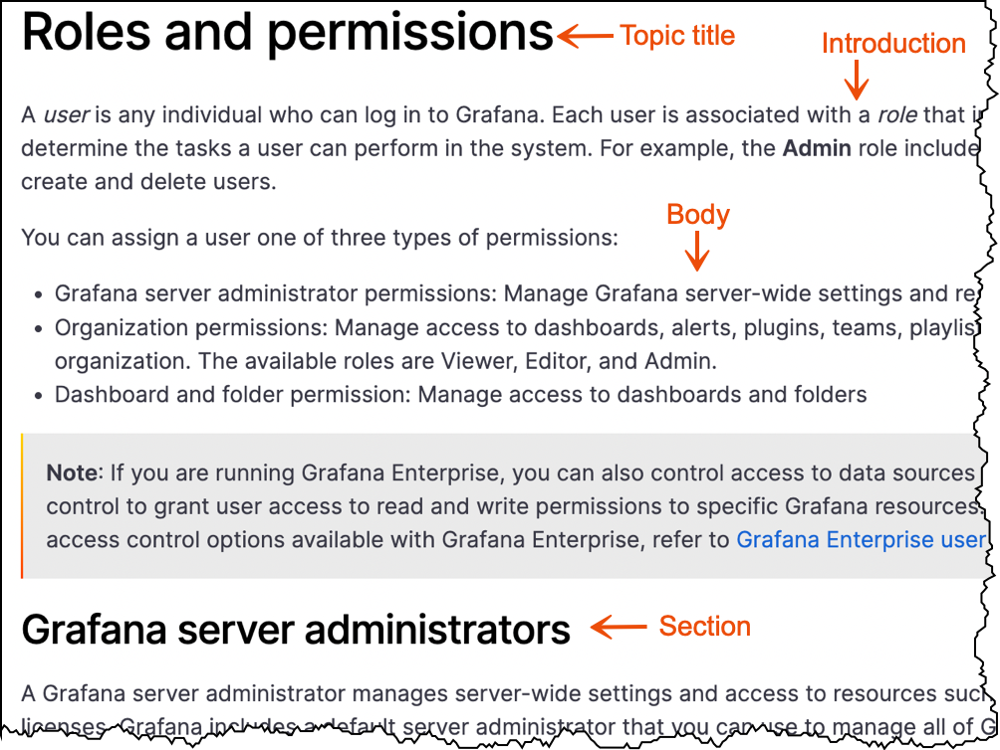

## Topic types

We categorize our documentation into concept, task, and reference topic types. All content must be placed into topics that are based on one of these basic topic types. Avoid mixing topic types within a single topic file.

If you are interested making use of our topic templates, refer to [Templates](https://github.com/grafana/writers-toolkit/tree/main/docs/static/templates).

## Concepts

Concepts provide overview and background information that helps end users understand essential information about a product, interface, or task.

Concepts answer the question "what is it?". When readers read concepts, they are learning about a feature. Use concepts to help the reader understand a technology, before they start using it.

The information in the topic supports the user in completing related tasks, and it and can include the following types of content:

- Feature overviews with descriptions of the benefits and clearly defined terms that are specific to Grafana
- Architectural diagrams that help users understand system components
- Process flow diagrams
- Best practice guidelines
- Long-form examples that show a feature in use. Examples might include supporting visuals, such as screenshots

Concept topics do not include:

- Step-by-step instructions
- Reference information, such as lookup tables or lists of values

### Concept topic examples

Refer to the following topics for concept topic examples:

- [Permissions overview](https://grafana.com/docs/grafana/latest/permissions/overview/)
- [Deployment modes](https://grafana.com/docs/loki/next/fundamentals/architecture/deployment-modes/)
- [Best practices for managing dashboards](https://grafana.com/docs/grafana/latest/best-practices/best-practices-for-managing-dashboards/)

### Concept template

When you are ready to write, make a copy of the [Concept template](https://github.com/grafana/writers-toolkit/blob/main/docs/static/templates/concept-template.md) and begin adding your content.

### Concept topic structure

A _concept_ topic includes the following elements:

- **Topic title:** Begin concept titles with the word _About_ followed by a noun. For example, _About Grafana panels_.
- **Introduction:** Add an introduction that explains what to expect in this topic.
- **Body:** Add as much content as required to thoroughly explain the concept. The body of a concept can contain various sections, visuals, and text.



### Write a concept topic

Complete the following steps to write a concept topic.

1. Review the information architecture of the Grafana Labs product documentation and determine the topic area to which you want to add feature documentation.
1. Within the topic area, create a feature directory that conforms to the following naming convention:
   - Use a noun
   - Use lower case letters
   - Add a hyphen between words
  <br>
  <br>
  For example:
     - organization-management
     - alert-groups
     - installation
     - service-accounts
<br>
<br>

1. Within the feature directory, create an `_index.md` file.
1. Add front matter to the `_index` file.

   For more information about front matter, refer to [Front matter]().

1. Add your content to the [concept template](https://github.com/grafana/writers-toolkit/blob/main/docs/static/templates/concept-template.md).

   For more information about the kinds of content you can add to a concept topic, refer to [Concepts](#concepts).


++++++++++++++++++NEEDS WORK+++++++++++++

**Task**
Provides procedural information, typically providing step-by-step instructions for
accomplishing a goal.

**Task:** Gives specific instructions about how to get something done to answer the question "how do I do <insert task>?". When readers read tasks, they are looking for action-oriented documentation to achieve a specific goal. This type of content will typically include numbered steps that the reader can follow to achieve that goal.


### Tasks

A _task_ topic lists the steps to take to produce an intended outcome. Tasks tell you _how_ to do something.

#### Task topic examples

Refer to the following topics for task topic examples:

- [Change your Grafana password](https://grafana.com/docs/grafana/latest/manage-users/user-admin/change-your-password/)
- [Install Grafana plugins](https://grafana.com/docs/grafana/latest/plugins/installation/)
- [Create a playlist](https://grafana.com/docs/grafana/v7.5/dashboards/playlist/#create-a-playlist/)

#### Task topic file naming convention

Use the following naming convention when you name task directories:

- Use lowercase letters.
- Add a hyphen between words.
- Begin the directory name with a verb, followed by an object.

For example, `change-password`.

#### Task topic structure

A _task_ topic includes the following elements:

**(A)** Topic title: Verb + object

- The ideal length is between seven and 12 words.

**(B)** Intro: Add an introduction to describe what the task is and why it’s important to the end user.

- This section of a task topic may include conceptual material. However, limit that conceptual information to only the task at hand.
- If you find yourself writing a long introduction, consider creating a concept topic, and then write a shorter form of that concept in the task introduction. Finally, link to the longer concept topic for more information.

**(C)** Before you begin: Add links to tasks to be completed before the current task. The links might sometimes be unrelated to the product, such as “Have this thing at hand”.

- This area can also include decisions that the user should make or permissions they might need to verify they have before they begin.
- Style this section as an H2.

**(D)** Stem sentence: Introduces the steps and provides a visual cue to users who scan content that the steps are about to begin. Style the stem sentence in **bold** text.

**(E)** Steps: Numbered steps that provide a directive to the user.

- Steps explicitly tell the user what to do and formatted using `1.` in Markdown so they get numbered automatically.
- Write steps so that they contain one action, or possibly two related actions, such as _Copy and paste a value._ or _Save and quit the program._
- If a sentence is not telling the reader to do something, then it is not a step.

Task structure image here

#### Task types

In most cases, each topic only contain one task. If you have several very short, related tasks, then you might combine them into one topic.

##### One-step task

Some tasks are so short that they only contain one step.

Write one-step tasks as simple sentences, not as unordered lists or numbered lists.

##### Group short tasks

You can group short tasks into a single topic. What constitutes _short_ is a judgment call based on the number of steps and how long individual steps are.

1. Use your judgment.
1. Ask your coworkers or someone on the Docs Squad for advice if you aren't sure.

##### Next steps

If the task you are writing leads naturally to one or more other tasks, then include links after the task to help the reader figure out where to go next.

Thanks to internet search engines, every page in the documentation could be page one. Pretend you are explaining your task to a new Grafana user.

##### Testing

It is a best practice to have someone else test the task you have written. If they can successfully complete the task using _only_ what the steps you have written, not guessing or using their inherent knowledge, then your task has passed the test. However, it is very common to find you have skipped steps because _you_ are very familiar with the topic you are explaining.

New users or people from other teams are very helpful for these tests.

+++++++++++++++++++++++++++


### When to combine tasks
In some cases task topics are standalone and are not combined with any other content. In other cases, it is appropriate to combine multiple task topics into a single markdown file. Combining tasks into a single topic limits the number of entries in the table of contents, which reduces user scrolling and clicking and provides for a nicer user experience with the documentation.

But do not randomly combine content into the same markdown file. When you combine content without a good reason can inadvertently hide content from the user and make it harder for them to find.

Consider the following guidelines when you combine multiple task topics:

- When you have documented more than one approach to accomplishing the same user goal.

  In the [Assign RBAC roles](https://grafana.com/docs/grafana/latest/administration/roles-and-permissions/access-control/assign-rbac-roles/) topic, a user can choose to use the user interface or provisioning to assign roles. In this case, you do not need to create two task topic files. Each task can exist with a more general topic title.

- When tasks that are likely to be completed at approximately the same time.

  When a user is likely to complete a group of tasks at the same time, it is more helpful for the user to have all task documentation available on the same page instead of navigating the table of contents to find other, related tasks.

  In the [Data source management](https://grafana.com/docs/grafana/latest/administration/data-source-management/) topic, it is likely that an Admin user is going to add a data source and enable permissions in rapid succession.

- When you document CRUD operations.

  Consider combining create, read, update, and delete tasks into the same topic. The [Manage organizations](https://grafana.com/docs/grafana/latest/administration/organization-management/) topic includes tasks for viewing, creating, editing, and deleting organizations all within the umbrella topic title of **Manage**.

- When you document a user workflow.

  Consider combining tasks when the user should start at the beginning, complete the first task, and then continue completing the remaining tasks in order.

  The [Activate a Grafana Enterprise license from AWS Marketplace on EKS](https://grafana.com/docs/grafana/latest/administration/enterprise-licensing/activate-aws-marketplace-license/activate-license-on-eks/) acts as a mini tutorial that guides the user through all tasks necessary to activate their license.

+++++++++++++++++++NEEDS WORK+++++++++++++++++
**Reference**
Provides "look-up" information that users might need to refer to when completing a task.

**Reference:** Contains structured information or specifications that users need to make a product work. Reference material answers the question "what else do I need to know?" When readers read references, they are fact-checking. Reference sections should comprehensively catalog data such as functions and their parameters, return codes, and error messages. They are often presented as tables, bulleted lists, or sample scripts.

Our templates follow these documentation types. Your information will naturally fit into these types as you write.

The _reference_ topic type is for storing reference information, such as extensive tables, lists, or other information that is used as support for a task. Reference topics are also designed for API information.

Often reference topics are linked from _task_ topics, because they contain information the you need in order to perform a task.

> **Note:** Do not include steps or conceptual information in reference topics.

### References

The _reference_ topic type is for storing reference information, such as extensive tables, lists, or other information that is used as support for a task. Reference topics are also designed for API information.

Often reference topics are linked from _task_ topics, because they contain information the you need in order to perform a task.

> **Note:** Do not include steps or conceptual information in reference topics.

#### Reference topic example

Refer to the following topics for a reference topic example:

- [Grafana CLI](https://grafana.com/docs/grafana/latest/administration/cli/)

#### Reference topic file naming conventions

Use the following naming conventions when you name reference files:

- Use lowercase letters.
- Add a hyphen between words.
- Begin reference topic file names with `reference` followed by a qualifier + noun, where possible.

For example, `reference-calculation-types.md`.

#### Reference topic structure

A reference topic includes the following elements:

**(A)** Reference topic naming convention: `Reference:` + qualifier + noun.

- Reference topics appear in the TOC as follows:

Reference TOC image here

**(B)** Intro: Add an introduction that describes the purpose of the content in the topic, in the form of one or two sentences.

**(C)** Body content: Reference topics provide look-up information and so are typically formatted as a table or a list.

Reference topic image here

#### Reference topic types

The body content of a reference topic is _generally_ formatted as lists, or tables.

##### Lists

Lists of commands or parameters are often organized in reference topics. The information you need to present dictates the format:

- They might
- be in
- unordered lists

To see an example of a reference topic formatted as a list, refer to [Configuration](https://grafana.com/docs/grafana/latest/installation/configuration/).

##### Tables

If you have a large list of things to store in a table, then you are probably dealing with reference information.

To see an example of a reference topic that contains a table, refer to [Glossary](https://grafana.com/docs/grafana/latest/guides/glossary/).

###### Empty Markdown table

Although you might not need a heading for each table, headings are a good way to chunk information if you have several tables.

Tables make the content easy to skim. Use headings or introductory paragraphs to explain to the reader the information contained in the table.

```
|     |     |     |     |     |     |
| :-- | :-- | :-: | :-: | --: | --: |
|     |     |     |     |     |     |
|     |     |     |     |     |     |
|     |     |     |     |     |     |
|     |     |     |     |     |     |
```

##### API documentation

API documentation is always a reference topic rather than a task topic, but it has its own rules.
