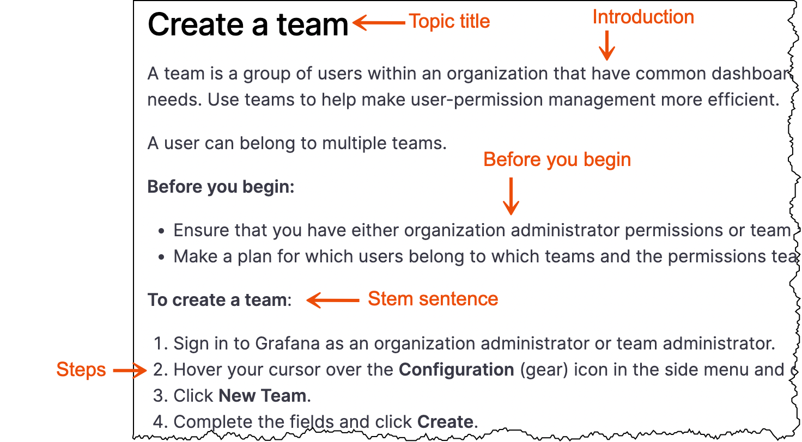

# Topic types

Grafana Labs documentation fits into topic types: concept, task, and reference. All content must be placed into topics that are based on one of these basic topic types. Avoid mixing topic types within a single topic file.

If you are interested making use of our topic templates, refer to [Templates](https://github.com/grafana/writers-toolkit/tree/main/docs/static/templates).

## Concepts

Concepts provide overview and background information that helps end users understand essential information about a product, interface, or task.

Concepts answer the question "what is it?". When readers read concepts, they are learning about a feature. Use concepts to help the reader understand a technology, before they start using it.

Concepts can include the following types of content:

- Feature overviews with descriptions of the benefits and clearly defined terms that are specific to Grafana
- Architectural diagrams that help users understand system components
- Process flow diagrams
- Best practice guidelines
- Long-form examples that show a feature in use. Examples might include supporting visuals, such as screenshots

Concept topics do not include:

- Step-by-step instructions
- Reference information, such as lookup tables or lists of values

### Concept topic structure

A _concept_ topic includes the following elements:

- **Topic title:** Title concept topics with a noun, for example, *Grafana panels*. This naming convention helps readers distinguish between conceptual topics and tasks that begin with a verb.
- **Introduction:** Add an introduction that explains what to expect in this topic.
- **Body:** Add as much content as required to thoroughly explain the concept. The body of a concept can contain sections, visuals, and text.

### Write a concept topic

Complete the following steps to write a concept topic.

1. Review the information architecture of the Grafana Labs product documentation and determine the topic area to which you want to add feature documentation.
1. Within the topic area, create a feature directory that conforms to the following naming convention:

   - Use a noun
   - Use lower case letters
   - Add a hyphen between words
   
   
   For example:
     - organization-management
     - alert-groups
     - installation
     - service-accounts
 
 

1. Within the feature directory, create an `_index.md` file.
1. Add front matter to the `_index` file.

   For more information about front matter, refer to [Front matter]().

1. Make a copy of the [concept template](https://github.com/grafana/writers-toolkit/blob/main/docs/static/templates/concept-template.md) and add the content.

   For more information about the kinds of content you can add to a concept topic, refer to [Concepts](#concepts).

### Concept topic examples

Refer to the following topics for concept topic examples:

- [Roles and permissions](https://grafana.com/docs/grafana/latest/administration/roles-and-permissions/)
- [Deployment modes](https://grafana.com/docs/loki/next/fundamentals/architecture/deployment-modes/)
- [Best practices for managing dashboards](https://grafana.com/docs/grafana/latest/best-practices/best-practices-for-managing-dashboards/)

### Concept template

When you are ready to write, make a copy of the [Concept template](https://github.com/grafana/writers-toolkit/blob/main/docs/static/templates/concept-template.md) and begin adding your content.

## Tasks

A _task_ topic lists the steps a user takes to produce an intended outcome. Tasks tell a user _how_ to do something.

When readers read tasks, they are looking for action-oriented documentation to achieve a specific goal. This type of content includes numbered steps that the reader can follow to achieve that goal. 

### Task structure

A _task_ topic includes the following elements:

**Topic title:** Write a task topic title with a verb + object combination.

**Introduction:** Add an introduction to describe what the task is and why it’s important to the end user.

- This section of a task topic might include conceptual material. However, limit that conceptual information to only the task at hand.
- If you find yourself writing a long introduction, consider creating a concept topic, and then write a shorter form of that concept in the task introduction. Finally, link to the longer concept topic for more information.

**Before you begin: (optional)** Add links to tasks to be completed before the current task. The links might sometimes be unrelated to the product, such as “Have this thing at hand”.
- This section can also include decisions that the user should make or permissions they might need to verify before they start the task.
- Do not include this section if there are no prerequisites.

**Stem sentence: (optional)** The stem sentence introduces the steps and provides a visual cue to users who scan content that the steps are about to begin. Include a stem sentence only when you include a before you begin section.

**Steps:** Numbered steps that provide a directive to the user.
- Steps explicitly tell the user what to do and are formatted using `1.` in Markdown so they get numbered automatically.
- Write steps so that they contain one action, or possibly two related actions, such as _Copy and paste a value._ or _Save and quit the program._
- If a sentence does not tell the reader to do something, then it is not a step.

### Write a task topic

Complete the following steps to write a task topic.

1. Review the information architecture of the Grafana Labs product documentation and determine the feature to which you want to add task documentation.
1. Within the feature directory, create a task directory that conforms to the following naming convention:
   
   - Begin the directory name with a verb followed by an object.
   - Use lowercase letters.
   - Add a hyphen between words.
   
   
   For example:
     - manage-dashboard-permissions
     - manage-organization-users
 
 

1. Within the task directory, create an `index.md` file.
1. Add front matter to the `index` file.

   For more information about front matter, refer to [Front matter]().

1. Make a copy of the [Task template](https://github.com/grafana/writers-toolkit/blob/main/docs/static/templates/task-template.md) and add the content.

### Task topic examples

Refer to the following topics for task topic examples:

- [Create a service account](https://grafana.com/docs/grafana/latest/administration/service-accounts/#create-a-service-account-in-grafana)
- [Create an organization](https://grafana.com/docs/grafana/latest/administration/organization-management/#create-an-organization)
- [Create a dashboard and add a panel](https://grafana.com/docs/grafana/latest/dashboards/add-organize-panels/#create-a-dashboard-and-add-a-panel)

### Task template

When you are ready to write, make a copy of the [Task template](https://github.com/grafana/writers-toolkit/blob/main/docs/static/templates/task-template.md) and begin adding your content.

### When to combine tasks into a single topic

In some cases task topics are standalone and are not combined with any other content. In other cases, it is appropriate to combine multiple task topics into a single Markdown file. Combining tasks into a single topic limits the number of entries in the table of contents, which reduces user scrolling and clicking, and provides for a more enjoyable user experience.

> **Note:** Do not randomly combine content into the same Markdown file. When you combine content without a good reason, you can inadvertently hide content from the user.

Consider the following guidelines when you combine multiple task topics:

- When you have documented more than one approach to accomplishing the same user goal.

  In the [Assign RBAC roles](https://grafana.com/docs/grafana/latest/administration/roles-and-permissions/access-control/assign-rbac-roles/) topic, a user can choose to use the user interface or provisioning to assign roles. In this case, you do not need to create two task topic files. Each task can exist within a more general topic title.

- When tasks that are likely to be completed at approximately the same time.

  When a user is likely to complete a group of tasks at the same time, it is helpful for the user to have all task documentation available on the same page.

  In the [Data source management](https://grafana.com/docs/grafana/latest/administration/data-source-management/) topic, it is likely that an Admin user is going to add a data source and enable permissions in rapid succession.

- When you document CRUD operations.

  Consider combining create, read, update, and delete tasks into the same topic. The [Manage organizations](https://grafana.com/docs/grafana/latest/administration/organization-management/) topic includes tasks for viewing, creating, editing, and deleting organizations all within the umbrella topic title of **Manage**.

- When you document a user workflow.

  Consider combining tasks when the user should start at the beginning, complete the first task, and then continue completing the remaining tasks in order.

  The [Activate a Grafana Enterprise license from AWS Marketplace on EKS](https://grafana.com/docs/grafana/latest/administration/enterprise-licensing/activate-aws-marketplace-license/activate-license-on-eks/) acts as a mini tutorial that guides the user through all tasks necessary to activate their license.

## References

Reference topics provide look-up information that users might need to refer to when completing a task. References should comprehensively catalog data such as functions and their parameters, return codes, and error messages. They are often presented as tables, bulleted lists, or sample scripts.

Reference topics are also designed for API information.

Reference topics are often linked from _task_ topics, because they contain information the user needs to perform a task.

> **Note:** Do not include steps or conceptual information in reference topics.

### Reference structure

- **Topic title:** Title reference topics with a qualifier + noun, for example, *Grafana CLI*. This naming convention helps readers distinguish between reference topics and tasks that begin with a verb.
- **Introduction:** Add an introduction that explains what to expect in this topic.
- **Body:** Reference topics provide look-up information and so are typically formatted as a table or a list.

### Write a reference topic

Complete the following steps to write a task topic.

1. Review the information architecture of the Grafana Labs product documentation and determine the feature to which you want to add reference documentation.
1. Within the feature directory, create a reference directory that conforms to the following naming convention:
   
   - Begin the directory name with a qualifier followed by an noun.
   - Use lowercase letters.
   - Add a hyphen between words.
   
   
   For example:
     - calculation-types
     - standard-field-definitions
 
 

1. Within the reference directory, create an `index.md` file.
1. Add front matter to the `index` file.

   For more information about front matter, refer to [Front matter]().

1. Make a copy of the [Reference template](https://github.com/grafana/writers-toolkit/blob/main/docs/static/templates/reference-template.md) and add the content.

### Reference topic example

Refer to the following topics for a reference topic example:

- [Calculation types](https://grafana.com/docs/grafana/latest/panels/calculation-types/)
- [Standard field definitions](https://grafana.com/docs/grafana/latest/panels/standard-field-definitions/)
- [Grafana CLI](https://grafana.com/docs/grafana/latest/administration/cli/)

### Reference template

When you are ready to write, make a copy of the [Reference template](https://github.com/grafana/writers-toolkit/blob/main/docs/static/templates/task-template.md) and begin adding your content.
