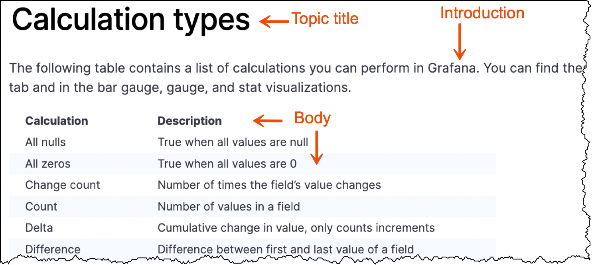

# Reference topics

A reference topic provides users with the information they might need to refer to during a task. An effective reference should provide a comprehensive listing of data, such as functions and parameters, error messages, and return codes. A reference is usually presented as a table, a bulleted list, or a sample script.

API information is also included in reference topics.

Because reference topics contain information the user needs to accomplish a task, they are often linked to task topics.

> **Note:** Do not include steps or conceptual information in reference topics.

## Reference structure

- **Topic title:** Reference topic titles should contain a qualifier and noun, for example, *Grafana CLI*. This helps readers distinguish between reference topics and tasks.
- **Introduction:** Provide an introduction that explains what to expect from this topic.
- **Body:** Tables or lists are often used to provide information in reference topics.

## Write a reference topic

To write a reference, complete these steps:

1. Determine where you want to add reference documentation to the Grafana Labs product documentation.
1. Create a child directory within the parent directory that follows this naming convention:
   
   - Begin the directory name with a qualifier followed by an noun.
   - Use lowercase letters.
   - Add a hyphen between words.
   
   
   For example:
     - calculation-types
     - standard-field-definitions
 
 

1. Create an `index.md` file within the reference directory.
1. Add front matter to the `index` file.

   For more information about front matter, refer to [Front matter]().

1. Add the content to a copy of the [Reference template](https://github.com/grafana/writers-toolkit/blob/main/docs/static/templates/reference-template.md).

## Reference topic examples

Refer to the following topics for a reference topic examples:

- [Calculation types](https://grafana.com/docs/grafana/latest/panels/calculation-types/)
- [Standard field definitions](https://grafana.com/docs/grafana/latest/panels/standard-field-definitions/)
- [Grafana CLI](https://grafana.com/docs/grafana/latest/administration/cli/)

## Reference template

When you are ready to write, make a copy of the [Reference template](https://github.com/grafana/writers-toolkit/blob/main/docs/static/templates/task-template.md) and add your content.
