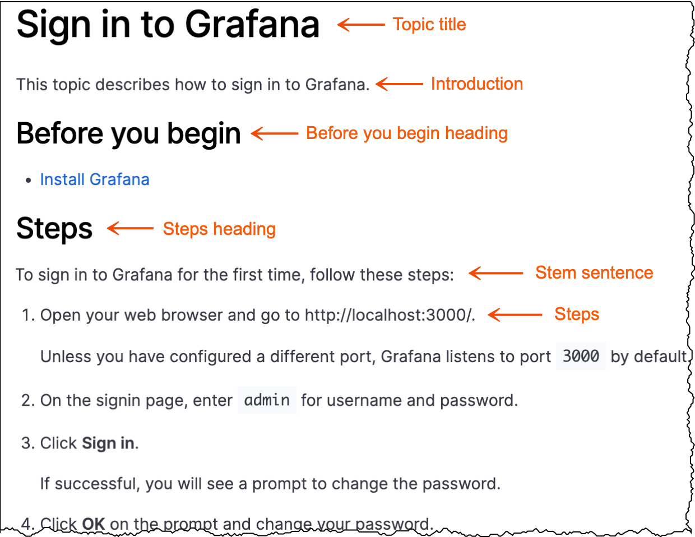

# Task topic

Task topics include numbered steps that describe how to achieve an outcome. 

## Task structure

A _task_ topic includes the following elements:

**Topic title:** Write a task topic title that combines a verb and an object.

**Introduction:** Provide an introduction that explains why the end user should care about the task.

- There might be conceptual material in this section of a task topic. Limit conceptual information to only what is relevant to the task at hand.
- If you find yourself writing a long introduction, consider creating a concept topic, and then writing a shorter form of that concept in the task introduction. The longer concept topic can be accessed for more information by linking to it.

**Before you begin: (optional)** Add links to tasks that need to be completed before the current one. The links might sometimes be unrelated to the product, such as “Have this thing at hand”.
- Additionally, this section can include decisions the user should make or permissions they need to confirm before starting the task.
- If there are no prerequisites, do not include this section.

**Stem sentence: (optional)** The stem sentence introduces the steps and signals to users who scan content that the steps are about to begin. You should include a stem sentence only when you include a before you begin section.

**Steps:** Users are provided with a directive through numbered steps.
- Write steps so that they contain one action, or possibly two related actions, such as _Copy and paste a value_ or _Save and quit the program._
- Unless a sentence instructs the reader to act, it isn't a step.

## Write a task topic

To write a task, complete these steps:

1. Determine where you want to add task documentation to the Grafana Labs product documentation.
1. Create a child directory within the parent directory that follows this naming convention:
   
   - The directory name should include a verb and an object.
   - Use lowercase letters.
   - Add a hyphen between words.
   
   
   For example:
     - manage-dashboard-permissions
     - manage-organization-users
 
 

1. Create an `index.md` file within the task directory.
1. Add front matter to the `index` file.

   For more information about front matter, refer to [Front matter]().

1. Add the content to a copy of the [Task template](https://github.com/grafana/writers-toolkit/blob/main/docs/static/templates/task-template.md).

### Task topic examples

Refer to the following topics for task topic examples:

- [Create a service account](https://grafana.com/docs/grafana/latest/administration/service-accounts/#create-a-service-account-in-grafana)
- [Create an organization](https://grafana.com/docs/grafana/latest/administration/organization-management/#create-an-organization)
- [Create a dashboard and add a panel](https://grafana.com/docs/grafana/latest/dashboards/add-organize-panels/#create-a-dashboard-and-add-a-panel)

## Task template

When you are ready to write, make a copy of the [Task template](https://github.com/grafana/writers-toolkit/blob/main/docs/static/templates/task-template.md) and add your content.

## When to combine tasks into a single topic

In some cases, task topics are standalone and do not contain any other content. Other times, multiple task topics can be combined into a single Markdown file. By combining tasks into a single topic, the table of contents entities can be reduced in number, which reduces scrolling and clicking for users.

> **Note:** It is not a good idea to combine content in the same Markdown file at random. If you combine content incorrectly, you may inadvertently hide information from the user.

When combining multiple topics into one, follow these guidelines:

- When you document more than one approach to accomplishing the same user goal.

  In the [Assign RBAC roles](https://grafana.com/docs/grafana/latest/administration/roles-and-permissions/access-control/assign-rbac-roles/) topic, a user can use the user interface or provisioning to assign roles. There is no need to create two task topic files in this case.

- When tasks are likely to be completed around the same time.

  Users might find it useful to have all task documentation available on the same page if they are likely to complete a number of tasks simultaneously.

  In the [Data source management](https://grafana.com/docs/grafana/latest/administration/data-source-management/) topic, it is likely that an Admin user will enable permissions immediately after adding a data source.

- When you document CRUD operations.

  Create, read, update, and delete tasks can be combined into one topic. The [Manage organizations](https://grafana.com/docs/grafana/latest/administration/organization-management/) topic includes tasks such as viewing, creating, editing, and deleting organizations all under the umbrella topic title of **Manage**.

- When you document a user workflow.

  Combine tasks when the user should start at the beginning, complete the first task, and then complete the remaining tasks in sequence.

  In [Activate a Grafana Enterprise license from AWS Marketplace on EKS](https://grafana.com/docs/grafana/latest/administration/enterprise-licensing/activate-aws-marketplace-license/activate-license-on-eks/), the user is guided through all the tasks necessary to activate their license.
