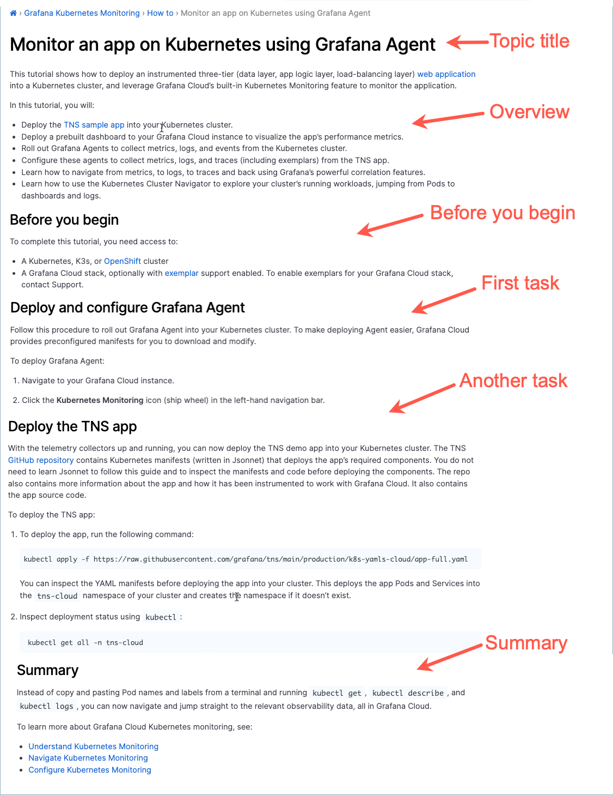

# Tutorial topic

The purpose of a tutorial is to show the reader how to "learn by doing" in a safe environment. A tutorial should build up easy successes that inspire a user to say, “I just did that! Wow!” The length of a tutorial can vary from a few steps to many subtasks.

> If you have an idea for a tutorial you'd like to develop, contact the tutorial team, Matt Abrams, Melori Arellano, and Eve Meelan, for guidance.

## Tutorial structure

A tutorial topic includes the following elements:

**Topic title:** Write a tutorial topic title that combines a verb and an object.

**Overview:** Let the user know the goal they will achieve by completing the tutorial. Provide context and include a list of the tasks the user will complete. Suggested text: "In this tutorial, you will …". 

- There can be conceptual material in this section of a tutorial topic. However, limit conceptual information to only what is relevant to the goal at hand.
- If you find yourself writing a long introduction, consider creating a concept topic, and then writing a shorter form of that concept in the tutorial introduction. The longer concept topic can be accessed for more information by linking to it.

**Before you begin (optional):** Describe or add links to tasks that need to be completed before the tutorial. The links might sometimes be unrelated to the product, such as “Have this thing at hand."
- Additionally, this section can include decisions the user should make or permissions they need to confirm before starting the tutorial.
- Use a bulleted list if there is more than one prerequisite.
- If there are no prerequisites, do not include this section.

**Task section (or sections)**: Create a section for each task needed to complete the tutorial. Follow the [task guidelines]() to write the tasks. 

- To determine what tasks and steps you should include in your tutorial, perform a goal analysis and determine the valuable outcome the user wants to achieve. Limit the tutorial to the tasks needed to satisfy that goal. Work with a Subject Matter Expert (SME) to determine the goal and the minimal set of tasks. If possible, record the SME completing the tasks needed to accomplish the goal or ask the SME to record a demo of the tasks if that's preferable. 
- Work with a Subject Matter Expert (SME) to 
- Provide steps that explain how to access or set up the data needed to complete the task. See [Data for your tutorial](#data-for-your-tutorial) for details.
- Do not include written step numbers in the header, for example, "Step 1: Pick apples." Instead, include just the verb and object, for example "Pick apples."
- Include only the tasks required for a straight path to the tutorial's goal, not optional or alternative paths. 
- Minimize the explanation within task steps. Instead, link to supporting explanations in related concept, task, and reference topics. 

**Summary (optional):** Describe what the tutorial user has accomplished. 

**Next steps (optional):** Provide logical next steps, if they exist.  



## Write a tutorial topic

To write a tutorial, complete these steps:

1. Add a `sources/tutorials` directory to your project repo if one does not yet exist.

    The tutorial is stored in your repo but it is displayed on the Grafana [Tutorials](/tutorials/) page. See [Publish your tutorial](#publish-your-tutorial) for details.

1. Create a child directory within the `tutorials` directory that follows this naming convention:
   
   - The directory name should include a verb and an object.
   - Use lowercase letters.
   - Add a hyphen between words.
  <br>
  <br>
   For example:
     - manage-dashboard-permissions
     - manage-organization-users
<br>
<br>

1. Create an `index.md` file within the tutorial's directory.
1. Add front matter to the `index` file.

   For more information about front matter, refer to [Front matter]().

1. Add the content to a copy of the [Tutorial template](https://github.com/grafana/writers-toolkit/blob/main/docs/static/templates/tutorial-template.md).

## Tutorial template

When you are ready to write, make a copy of the [Tutorial template](https://github.com/grafana/writers-toolkit/blob/main/docs/static/templates/tutorial-template.md) and add your content.

## Difference between tutorials and task topics

The difference between a tutorial and a task topic is that a tutorial is for learning, and a task is for actual operational work. Another important distinction is that a tutorial typically provides a "sandbox" environment&mdash;a source of data that users can safely experiment with. 
 
## Data for your tutorial
 
Depending on the application, your tutorial's data might be:

  - In a sandbox
  - On test servers
  - In demo repos that the user clones locally
 
For example, the [Play with Grafana Mimir](/tutorials/play-with-grafana-mimir/) tutorial provides a repo that users can clone in order to complete the tutorial. As a comparison, the Mimir [Storing exemplars in Grafana Mimir](/docs/mimir/latest/operators-guide/use-exemplars/storing-exemplars/) topic is a pure task that a user would follow to complete their work.

If getting access to the tutorial data is complex, include the instructions in the steps of the tutorial. If getting access to the data is straightforward, include it in the "Before you begin" section.

## Publish your tutorial

Your tutorial source is stored in your project repo in a `tutorials` folder and mounted to the tutorials repo so that it can be displayed on the [Tutorials](/tutorials) page. The source is stored in your project repo to make it easy for team members to review and edit the content. 

The following sections describe how to hide the tutorial from your project's table of contents and to display it on the Tutorials page. 

### Hide your tutorial from your Table of Contents

Tutorials are for learning, so it's best to keep them together on the Tutorials page, accessible directly from the Grafana website's **Learn** menu. As such, you need to hide the tutorial so that it doesn't appear in your project's table of contents.

#### Before you begin

Before completing these steps, you need to create a `tutorials` directory under `sources` and add your tutorial into its own subdirectory as described in the [Write a tutorial topic](#write-a-tutorial-topic) section.

To hide your tutorial from your documentation's table of contents:

1. Open your project's `sources/_index.md` file.

1. Add the following code to the `$.cascade` field in the YAML metadata. 

    ```yaml
    cascade:
    - _target:
        path: /docs/grafana-cloud/tutorials/**
      _build:
        list: false
        render: false
    - _target:
        path: /docs/grafana-cloud/**
    ```

    > **Note**: Create the `cascade` field if it does not exist. Substitute your repo for `grafana-cloud` in this example.

### Add your tutorial to the Tutorials page

> **Note**: This procedure is for writers who have permissions to update the Grafana website repo.

To add your tutorial to the Tutorials page:

1. Add the following code to the `$.manual_mounts` field in the `config/_default/config.yaml` file in the website repo:

    ```yaml
    manual_mounts:
      - source: content/docs/grafana-cloud/tutorials/k8s-monitoring-app
        target: content/tutorials/k8s-monitoring-app
    ```

    > **Note**: Create the `manual_mounts` field if it does not exist. Substitute the source and target with your tutorial's path and name.

1. Add the following code to the `list` field in the `data/tutorials.yaml` file in the website repo:

   ```yaml
   list:
     - page: /tutorials/k8s-monitoring-app/
       level: beginner
       type: tutorial
   ```
    > **Note**: Create the `list` field if it does not exist. Substitute the path to your tutorial for `page` and specify the `level` and `technology` for your tutorial. These values are used to filter the Tutorials page.

1. After peer reviews, merge your PR and test that your tutorial displays correctly on the Tutorials page.
    
## Tutorial topic example

Refer to the following topic for a tutorial example:

- [Monitor an app on Kubernetes using Grafana Agent](/docs/grafana-cloud/kubernetes-monitoring/how-to/k8s-monitor-app/).