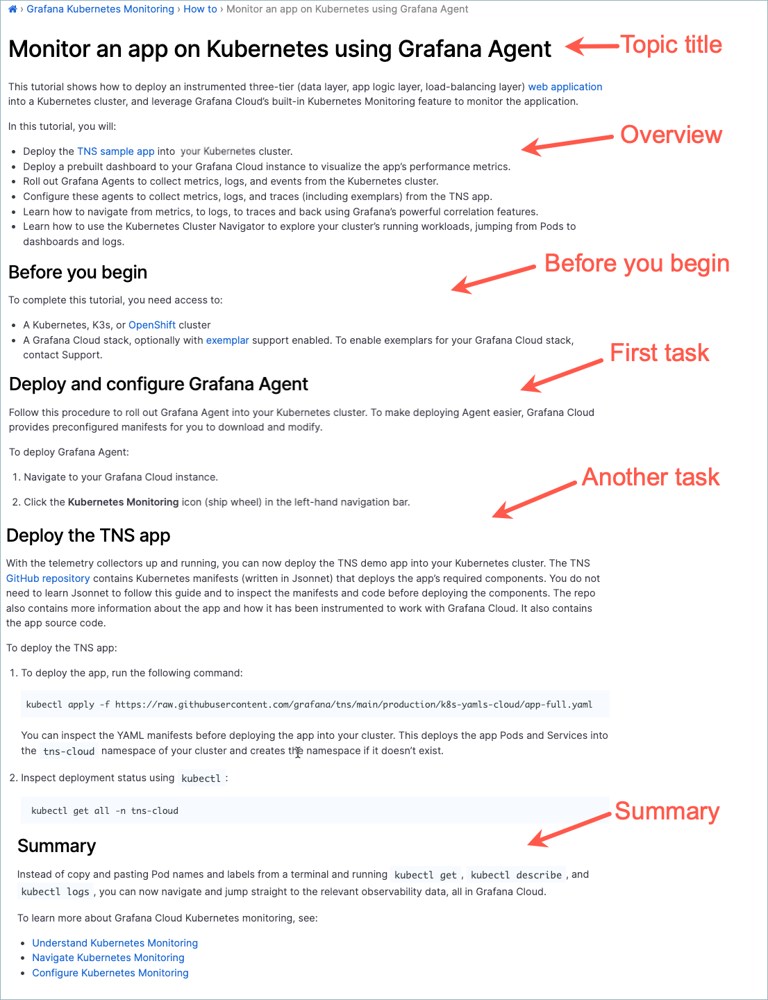

# Tutorial topic

The purpose of a tutorial is to show the reader how to "learn by doing" in a safe environment. A tutorial should build up easy successes that inspire a user to say, “I just did that! Wow!” The length of a tutorial can vary from a few steps to many subtasks.

> If you have an idea for a tutorial you'd like to develop, contact the tutorial team, Matt Abrams, Melori Arellano, and Eve Meelan, for guidance.

## Tutorial structure

A tutorial topic includes the following elements:

**Topic title:** Write a tutorial topic title that combines a verb and an object.

**Overview:** Let the user know the goal they will achieve by completing the tutorial. Provide context and include a list of the tasks the user will complete. Suggested text: "In this tutorial, you will …". 

- There can be conceptual material in this section of a tutorial topic. However, limit conceptual information to only what is relevant to the goal at hand.
- If you find yourself writing a long introduction, consider creating a concept topic, and then writing a shorter form of that concept in the tutorial introduction. The longer concept topic can be accessed for more information by linking to it.

**Before you begin (optional):** Describe or add links to tasks that need to be completed before the tutorial. The links might sometimes be unrelated to the product, such as “Have this thing at hand."
- Additionally, this section can include decisions the user should make or permissions they need to confirm before starting the tutorial.
- Use a bulleted list if there is more than one prerequisite.
- If there are no prerequisites, do not include this section.

**Task section (or sections)**: Create a section for each task needed to complete the tutorial. Follow the [task guidelines]() to write the tasks. 

- To determine what tasks and steps you should include in your tutorial, perform a goal analysis and determine the valuable outcome the user wants to achieve. Limit the tutorial to the tasks needed to satisfy that goal. Work with a Subject Matter Expert (SME) to determine the goal and the minimal set of tasks. If possible, record the SME completing the tasks needed to accomplish the goal or ask the SME to record a demo of the tasks if that's preferable. 
- Work with a Subject Matter Expert (SME) to 
- Provide steps that explain how to access or set up the data needed to complete the task. See [Data for your tutorial](#data-for-your-tutorial) for details.
- Do not include written step numbers in the header, for example, "Step 1: Pick apples." Instead, include just the verb and object, for example "Pick apples."
- Include only the tasks required for a straight path to the tutorial's goal, not optional or alternative paths. 
- Minimize the explanation within task steps. Instead, link to supporting explanations in related concept, task, and reference topics. 

**Summary (optional):** Describe what the tutorial user has accomplished. 

**Next steps (optional):** Provide logical next steps, if they exist.  

## Write a tutorial topic

To write a tutorial, complete these steps:

1. Determine where you want to add a tutorial to the Grafana Labs product documentation.

    You can include tutorials wherever they make sense in your documentation hierarchy. Some tutorials are included on the [Tutorials](/tutorials/) page, but you can add tutorials within your own repos, as well.  

1. Create a child directory within the parent directory that follows this naming convention:
   
   - The directory name should include a verb and an object.
   - Use lowercase letters.
   - Add a hyphen between words.
   
   
   For example:
     - manage-dashboard-permissions
     - manage-organization-users
 
 

1. Create an `index.md` file within the task directory.
1. Add front matter to the `index` file.

   For more information about front matter, refer to [Front matter]().

1. Add the content to a copy of the [Tutorial template](https://github.com/grafana/writers-toolkit/blob/main/docs/static/templates/tutorial-template.md).

## Tutorial template

When you are ready to write, make a copy of the [Tutorial template](https://github.com/grafana/writers-toolkit/blob/main/docs/static/templates/tutorial-template.md) and add your content.

## Difference between tutorials and task topics

The difference between a tutorial and a task topic is that a tutorial is for learning, and a task is for actual operational work. Another important distinction is that a tutorial typically provides a "sandbox" environment&mdash;a source of data that users can safely experiment with. 
 
## Data for your tutorial
 
Depending on the application, your tutorial's data might be:

  - In a sandbox
  - On test servers
  - In demo repos that the user clones locally
 
For example, the [Play with Grafana Mimir](/tutorials/play-with-grafana-mimir/) tutorial provides a repo that users can clone in order to complete the tutorial. As a comparison, the Mimir [Storing exemplars in Grafana Mimir](/docs/mimir/latest/operators-guide/use-exemplars/storing-exemplars/) topic is a pure task that a user would follow to complete their work.

If getting access to the tutorial data is complex, include the instructions in the steps of the tutorial. If getting access to the data is straightforward, include it in the "Before you begin" section.

## Tutorial topic example

Refer to the following topic for a tutorial example:

- [Monitor an app on Kubernetes using Grafana Agent](/docs/grafana-cloud/kubernetes-monitoring/how-to/k8s-monitor-app/).