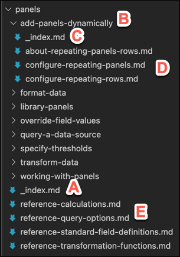
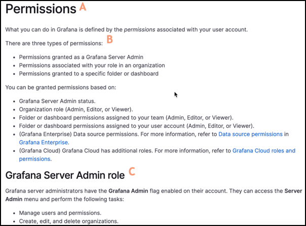
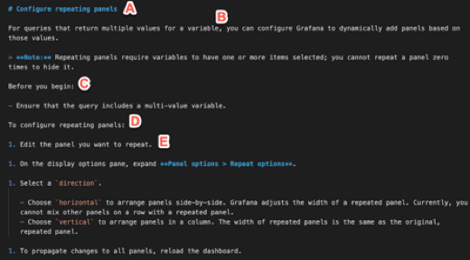
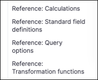
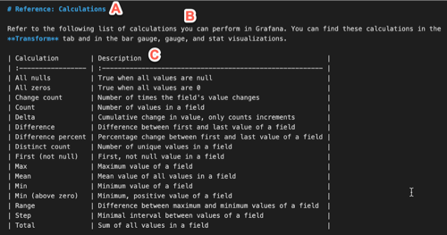

# Content structure and naming conventions

Due to our robust documentation contribution model, it is important that contributors have the same understanding when it comes to building out the documentation in any of Grafana Lab’s many repositories.

This topic addresses how to structure and name document folders and files, title topics, and includes information about specific topic types.

## Directory structure

Use the following guidelines when you create the directory.

**(A)**: Nest an `_index.md` file below the main topic directory:

- This file serves as the topic area home page.
- This topic includes an overview of what’s covered in the topic area.
- Use the `` short code to display child topic links on a page; remove any introductory phrase or sentence, such as “This section includes the following topics.” This will eliminate future bugs and manual bugs. 

**(B)**: Create a directory for each topic.

**(C)**: Add an `_index.md` file:

- Functionally, the `_index.md` file creates pretty URLs. For example, `eat-pie.html` ends up as `eat-pie/`, and you do not have to remember the file extension (`.htm` or `.html` or something else).
- Content-wise, use the `_index.md` file to provide an overview of what’s covered in that section and links to child pages.

**(D)**: Add one concept topic and all related task topics to a directory or subdirectory.

**(E)**: Nest reference files directly in the main topic directory; do not add them to subdirectories.



## Topic types

Technical content comprises three types of topics:

- Concept
- Task
- Reference

Use the following guidelines when you write concept, task, and reference topics.

### Concepts

Concepts provide content that helps users to understand _what_ a feature is and _why_ it is important. The information in the topic supports you in completing related tasks, and it and can include the following types of content:

- Feature overviews with descriptions of the benefits and clearly defined terms that are specific to Grafana
- Architectural diagrams that help users understand system components
- Process flow diagrams
- Best practice guidelines
- Long-form examples that show a feature in use. Examples might include supporting visuals, such as screenshots

Concept topics do not include:

- Step-by-step instructions
- Reference information, such as lookup tables or lists of values

#### Concept topic examples

Refer to the following topics for concept topic examples:

- [Permissions overview](https://grafana.com/docs/grafana/latest/permissions/overview/)
- [Deployment modes](https://grafana.com/docs/loki/next/fundamentals/architecture/deployment-modes/)
- [Best practices for managing dashboards](https://grafana.com/docs/grafana/latest/best-practices/best-practices-for-managing-dashboards/)

#### Concept topic file naming conventions

Use the following naming conventions when you name concept files:

- Use lowercase letters.
- Add a hyphen between words.
- Begin concept topic file names with ‘about’ followed by a noun.

For example, `about-grafana-panels.md`.

#### Concept topic structure

A _concept_ topic includes the following elements:

- **(A)** Topic title: Begin concept titles with the word _About_ followed by a noun. For example, _About Grafana panels_.
- **(B)** Introduction: Add an introduction that explains what to expect in this topic.
- **(C)** Body content: Add as much content as required to thoroughly explain the concept.
  - The body of a concept can contain various heading levels, visuals, and text.



### Tasks

A _task_ topic lists the steps to take to produce an intended outcome. Tasks tell you _how_ to do something.

#### Task topic examples

Refer to the following topics for task topic examples:

- [Change your Grafana password](https://grafana.com/docs/grafana/latest/manage-users/user-admin/change-your-password/)
- [Install Grafana plugins](https://grafana.com/docs/grafana/latest/plugins/installation/)
- [Create a playlist](https://grafana.com/docs/grafana/v7.5/dashboards/playlist/#create-a-playlist/)

#### Task topic file naming convention

Use the following naming convention when you name task files:

- Use lowercase letters.
- Add a hyphen between words.
- Begin task topic file with a verb, followed by an object.

For example, `change-password.md`.

#### Task topic structure

A _task_ topic includes the following elements:

**(A)** Topic title: Verb + object

- The ideal length is between seven and 12 words.

**(B)** Intro: Add an introduction to describe what the task is and why it’s important to the end user.

- This section of a task topic may include conceptual material. However, limit that conceptual information to only the task at hand.
- If you find yourself writing a long introduction, consider creating a concept topic, and then write a shorter form of that concept in the task introduction. Finally, link to the longer concept topic for more information.

**(C)** Before you begin: Add links to tasks to be completed before the current task. The links might sometimes be unrelated to the product, such as “Have this thing at hand”.

- This area can also include decisions that the user should make or permissions they might need to verify they have before they begin.
- Style this section as an H2.

**(D)** Stem sentence: Introduces the steps and provides a visual cue to users who scan content that the steps are about to begin. Style the stem sentence in **bold** text.

**(E)** Steps: Numbered steps that provide a directive to the user.

- Steps explicitly tell the user what to do and formatted using `1.` in Markdown so they get numbered automatically.
- Write steps so that they contain one action, or possibly two related actions, such as _Copy and paste a value._ or _Save and quit the program._
- If a sentence is not telling the reader to do something, then it is not a step.



#### Task types

In most cases, each topic only contain one task. If you have several very short, related tasks, then you might combine them into one topic.

##### One-step task

Some tasks are so short that they only contain one step.

Write one-step tasks as simple sentences, not as unordered lists or numbered lists.

##### Group short tasks

You can group short tasks into a single topic. What constitutes _short_ is a judgment call based on the number of steps and how long individual steps are.

1. Use your judgment.
1. Ask your coworkers or someone on the Docs Squad for advice if you aren't sure.

##### Next steps

If the task you are writing leads naturally to one or more other tasks, then include links after the task to help the reader figure out where to go next.

Thanks to internet search engines, every page in the documentation could be page one. Pretend you are explaining your task to a new Grafana user.

##### Testing

It is a best practice to have someone else test the task you have written. If they can successfully complete the task using _only_ what the steps you have written, not guessing or using their inherent knowledge, then your task has passed the test. However, it is very common to find you have skipped steps because _you_ are very familiar with the topic you are explaining.

New users or people from other teams are very helpful for these tests.

### References

The _reference_ topic type is for storing reference information, such as extensive tables, lists, or other information that is used as support for a task. Reference topics are also designed for API information.

Often reference topics are linked from _task_ topics, because they contain information the you need in order to perform a task.

> **Note:** Do not include steps or conceptual information in reference topics.

#### Reference topic example

Refer to the following topics for a reference topic example:

- [Grafana CLI](https://grafana.com/docs/grafana/latest/administration/cli/)

#### Reference topic file naming conventions

Use the following naming conventions when you name reference files:

- Use lowercase letters.
- Add a hyphen between words.
- Begin reference topic file names with `reference` followed by a qualifier + noun, where possible.

For example, `reference-calculation-types.md`.

#### Reference topic structure

A reference topic includes the following elements:

**(A)** Reference topic naming convention: `Reference:` + qualifier + noun.

- Reference topics appear in the TOC as follows:



**(B)** Intro: Add an introduction that describes the purpose of the content in the topic, in the form of one or two sentences.

**(C)** Body content: Reference topics provide look-up information and so are typically formatted as a table or a list.



#### Reference topic types

The body content of a reference topic is _generally_ formatted as lists, or tables.

##### Lists

Lists of commands or parameters are often organized in reference topics. The information you need to present dictates the format:

- They might
- be in
- unordered lists

To see an example of a reference topic formatted as a list, refer to [Configuration](https://grafana.com/docs/grafana/latest/installation/configuration/).

##### Tables

If you have a large list of things to store in a table, then you are probably dealing with reference information.

To see an example of a reference topic that contains a table, refer to [Glossary](https://grafana.com/docs/grafana/latest/guides/glossary/).

###### Empty Markdown table

Although you might not need a heading for each table, headings are a good way to chunk information if you have several tables.

Tables make the content easy to skim. Use headings or introductory paragraphs to explain to the reader what the information in the table is used for.

```
|     |     |     |     |     |     |
| :-- | :-- | :-: | :-: | --: | --: |
|     |     |     |     |     |     |
|     |     |     |     |     |     |
|     |     |     |     |     |     |
|     |     |     |     |     |     |
```

##### API documentation

API documentation is always a reference topic rather than a task topic, but it has its own rules.

## Headings

Write headings in sentence case, not title case:

- This is sentence case
- This is Title Case

### Heading don'ts

- Avoid stacked headings, which is following one heading with another heading without any content in between the two headings
- Avoid skipping heading levels. For example, an h1 should be followed by an h2 rather than an h3.
- Avoid having just one lower-level heading. For example, h1, h2, h2, h3, h3, h2, h2 is a good order. Do not go h1, h2, h3, h2, h3, h2.
- Avoid using hyphens in headings.
- Do not include parenthetical words like (Important!) in headings.

### Step-by-step headings

In most cases, headings do not contain step numbers.

However, sometimes we need to use headings as numbered steps. This is mostly in cases where each step is complex or a series of other procedures. For example, in [Getting started with Grafana and Prometheus](https://grafana.com/docs/grafana/latest/getting-started/getting-started-prometheus/).

If that is the case, then use the following format for headings:

#### Step 1. Install the software

#### Step 2. Run the software
